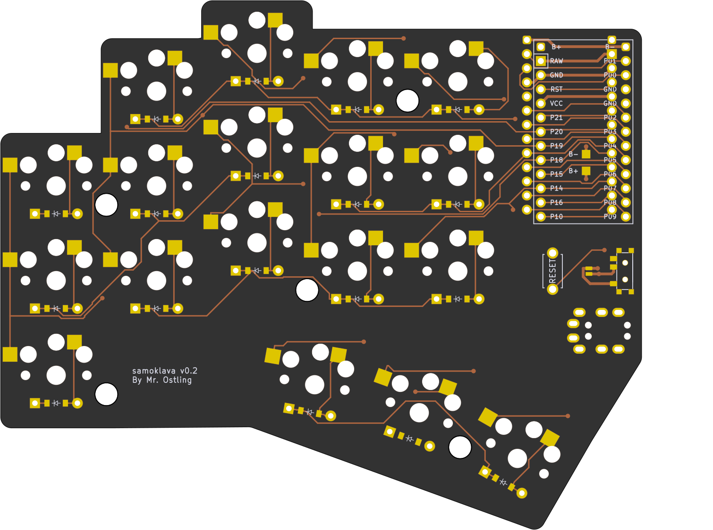
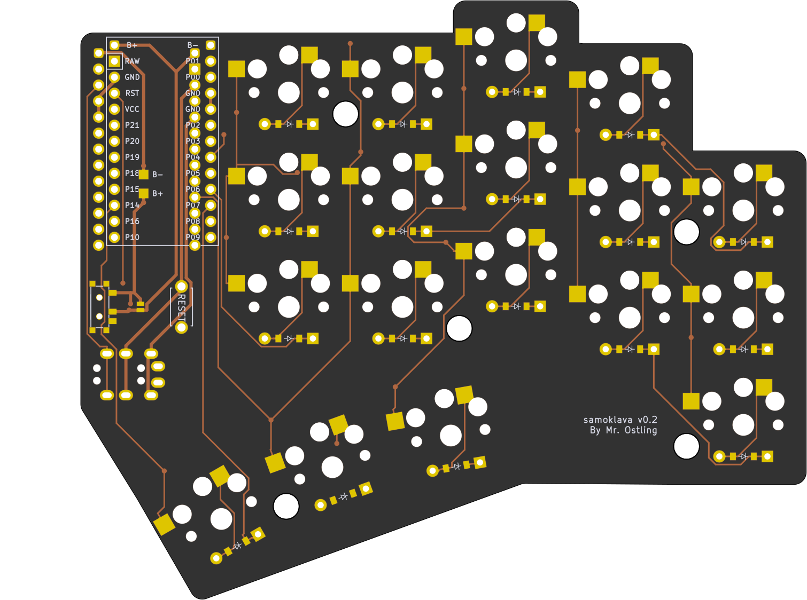

# samoklava
## An autogenerated split 36 key keyboard

left | right
-|-
 | 

WARNING, for some reason the center thumb diode doesn't get wired automatically. 
You will want to open the generated files in Kicad and add the missing routes and repackage before sending off for fabrication
(or just hand wire them in if you didn't catch it until you spent hours trying to track down all your bad solder joints 
only to find that one diode simply was not routed).

A 5x3 split keyboard with 3 thumbs. There is nothing unique about the keyboard layout. It's inspired by Corne and Kyria, and
has the exact number of keys needed for the [Miryoku](https://github.com/manna-harbour/miryoku) layout.

The interesting thing about this keyboard is that it's a declarative design ("samoklava" can be loosely translated as
"keyboard that assembles itself" from Russian).
* Layout is declared using [Ergogen](https://github.com/mrzealot/ergogen/)
* The build system uses Ergogen to translate YAML to a KiCad PCB and plate files for FR-4 fab or laser cutting
* uses [kicad-automation-scripts](https://github.com/productize/kicad-automation-scripts) and [FreeRouting](https://github.com/freerouting/freerouting) to **automatically route the traces on the PCB**
* uses [KiKit](https://github.com/yaqwsx/KiKit) to render PCB previews (see top of this file) and production-ready **Gerber files**

## Features

* Extra pins and a slider switch for battery for wireless Promicro clones (tested with nice!nano); the slider can be
  shorted with a jumper if `CONFIG_ZMK_SLEEP` is preferred.
* Wired operation with QMK should be possible but is not tested; TRRS footprints are included and routed. The pinout is
  identical with a five-column Corne sans the RGBLEDs.
* Reset switches are easily accessible. The footprints used are the same as on the Corne.

## How to

If you would like to modify this:
* fork it
* change `samoklava.yaml` to your liking
  * use `make clean design` to see what your board looks like, images in `design-output`
* push your changes; the `build.yml` GitHub Workflow will pick it up, autoroute and generate Gerbers, all in a zip file.
  See https://github.com/soundmonster/samoklava/actions
* or:
  * make sure to have Docker CLI and NodeJS installed
  * run `make setup clean all`
  * check the `output` folder for KiCad PCBs and Gerbers
* buy the parts in the BOM.csv
* assemble
* flash both halves with ZMK (https://github.com/soundmonster/samoklava-zmk-config, or https://github.com/manna-harbour/miryoku/issues/50)
* check all you keys
* start typing

See the [workflow](.github/workflows/build.yml) or the [Makefile](Makefile) for more details.
